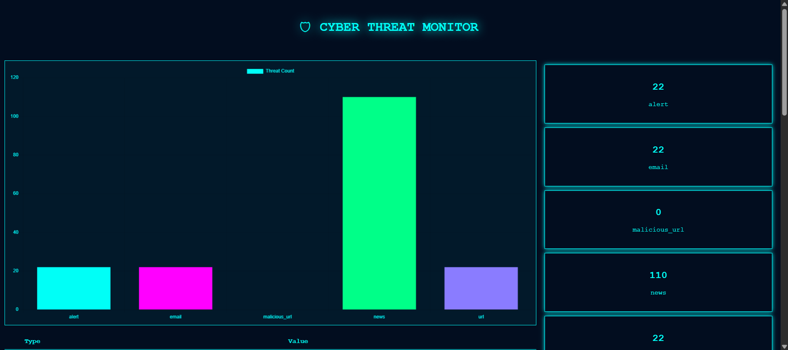

# 🛡️ Dark Web Threat Intelligence Dashboard



> A Real-Time Cyber Threat Intelligence Dashboard for SOC Operations
---

## 🌟 Overview

This project is a **Cyber Threat Intelligence Dashboard** that simulates how real-world SOC teams monitor threats.

It collects cybersecurity data, detects suspicious indicators (IOCs), analyzes risk, and displays everything in a **live dashboard with charts and alerts**.

---

## 🎯 What Problem Does This Solve?

Cybersecurity teams need to:

* Monitor threats continuously
* Detect malicious URLs & emails
* Respond quickly to attacks

👉 This project automates that workflow.

---

## 🔥 Key Features

* 📡 Real-time threat feed collection
* ☠️ Detection of malicious URLs
* 📧 Email & URL IOC extraction
* 🚨 Alert generation for high-risk threats
* 🧠 AI-based risk scoring system
* 🗄️ SQLite database storage
* 🌐 Flask-based web dashboard
* 📊 Live charts with auto-refresh
* 🎨 Cybersecurity-style UI (animated)

---

## 🧠 How It Works

Threat Feeds → IOC Detection → AI Analysis → Database → Dashboard

### Step-by-step:

1. **threat_intel.py**

   * Fetches threat news and malicious data

2. **IOC Detection**

   * Extracts:

     * URLs
     * Emails

3. **AI Analysis**

   * Assigns risk score (LOW / MEDIUM / HIGH)

4. **Database**

   * Stores everything in SQLite

5. **app.py**

   * Displays data in dashboard

---

## 🖥️ Tech Stack

| Technology    | Purpose         |
| ------------- | --------------- |
| Python        | Core logic      |
| Flask         | Web dashboard   |
| SQLite        | Database        |
| BeautifulSoup | Web scraping    |
| Requests      | API calls       |
| Chart.js      | Graphs & charts |
| HTML/CSS      | UI Design       |

---

## ⚙️ Installation & Setup

### 1️⃣ Clone Repository

```bash
git clone https://github.com/ManikandanF1/dark-web-threat-intel-tool.git
cd dark-web-threat-intel-tool
```

### 2️⃣ Install Dependencies

```bash
pip install flask requests beautifulsoup4 feedparser
```

### 3️⃣ Run Threat Intelligence Tool

```bash
python threat_intel.py
```

### 4️⃣ Run Dashboard (New Terminal)

```bash
python app.py
```

### 5️⃣ Open in Browser

http://127.0.0.1:5000

---

## 📊 Output

* Live threat dashboard
* IOC detection results
* Alerts for malicious activity
* Risk score visualization

---

## 🎯 Use Cases

✔ SOC Analyst practice
✔ Cybersecurity learning
✔ Threat monitoring simulation
✔ Interview project

---

## 🔐 Example Output

```
🚨 ALERT: High-risk URL detected!
📊 Risk Score: 6
🚨 Threat Level: HIGH
```

---

## 🔮 Future Improvements

* 🔗 VirusTotal API integration
* 🤖 Machine Learning anomaly detection
* 🔐 Login system
* ☁️ Cloud deployment (Render / AWS)
* 📱 Telegram alerts

---

## 👨‍💻 Author

**Manikandan G**

---

## ⭐ Support This Project

If you found this project helpful:

👉 Give it a ⭐ on GitHub
👉 Share with others
👉 Use it in your learning

---

## 🚀 Final Note

This project demonstrates:

* Real-time data processing
* Cybersecurity fundamentals
* Backend + frontend integration
* SOC workflow simulation

💡 *Built with passion for cybersecurity & learning*
